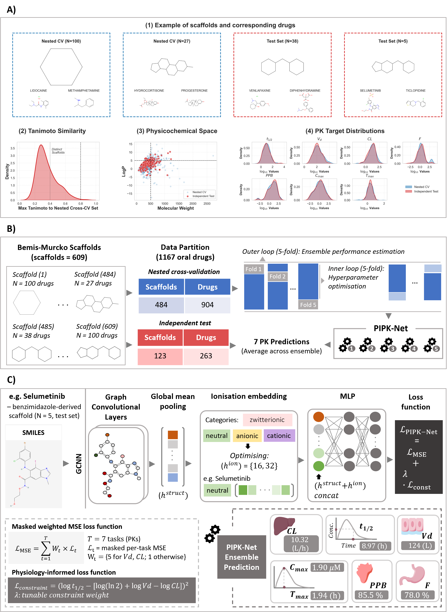

# PIPK-Net
**Physiology-Informed Graph Neural Network for Multitask PK Prediction**

PIPK-Net is a deep learning framework designed to address the parameterisation needs of Physiologically Based Pharmacokinetic (PBPK) models for orally administered small-molecule drugs. 

Accurate systemic PK prediction is often challenging due to the complexity of absorption, distribution, and elimination. PIPK-Net addresses this by integrating two novel components:
1. **Learnable Ionisation Embeddings:** Rather than treating ionisation as a fixed descriptor, the model encodes physiological state at pH 7.4 as a learnable embedding, capturing how charge influences drug fate (e.g., albumin binding for anions vs. tissue accumulation for cations).
2. **Mechanistic Loss Constraints:** The architecture embeds a mass-balance constraint ($t_{1/2} = \ln 2 \cdot V_d / CL$) directly into the training objective, ensuring that interdependent parameters remain consistent—a property often lacking in purely data-driven models.

---

## Overview



*PIPK-Net at a glance.* ***(A)*** *Dataset characterisation — example Bemis–Murcko scaffolds with their drugs, the Tanimoto-similarity distribution between the nested-CV and independent-test sets, the physicochemical (molecular weight vs. LogP) space, and the seven matched PK-target distributions.* ***(B)*** *Workflow — 1,167 oral drugs are partitioned by scaffold into a 904-drug nested-cross-validation set (5-fold outer ensemble with a 5-fold inner hyperparameter search) and a 263-drug independent test set, yielding a 5-model PIPK-Net ensemble whose seven PK predictions are averaged.* ***(C)*** *Architecture — a graph convolutional encoder with global mean pooling produces a structural embedding ($h^{struct}$) that is concatenated with a learnable ionisation embedding ($h^{ion}$) and decoded by an MLP, trained with a masked weighted MSE loss (weight 5 for $V_d$ and $CL$, 1 otherwise) plus a physiology-informed mass-balance constraint $\mathcal{L}_{const}=(\log t_{1/2}-[\log(\ln 2)+\log V_d-\log CL])^2$.*

---

## Project Structure
* `pipknet/`: Core package — architecture (`models.py`), featurisers, training engine, nested-CV `training.py`, CSV loader `data.py`, high-level `inference.py` (`PIPKNetPredictor`), and CLI.
* `examples/`: `tutorial.ipynb` walkthrough and `quickstart.py`.
* `checkpoints/`: Pre-trained ensemble weights (5-fold CV).
    * `A_baseline`: Baseline model variant
    * `B_ion`: Model variant incorporating ionisation embeddings
    * `C_physio`: The recommended Physiology-Informed variant (ionisation embeddings and physiological loss constraint)
* `reproduce/`: Scripts that regenerate every manuscript/supplementary figure and table from the checkpoints (see `reproduce/README.md`).
* `data/`: Clinical reference table for oral drugs (from eDrug3D dataset, downloaded August 2025), data splits, frozen predictions, and the benchmark results.
* `tests/`: Smoke tests (`pytest`).
* `environment.yml`: Conda environment definition for reproducibility.
* `pyproject.toml`: Python package configuration.

---

## Installation

### 1. Set Up Environment
Recreate the exact research environment using the provided `.yml` file:
```powershell
conda env create -f environment.yml
conda activate pk_project
```

### 2. Install PIPK-Net
Install the package in editable mode from the root directory:
```powershell
pip install -e .
```

## Usage

### Tutorial
A worked, runnable walkthrough (single-molecule + batch prediction, the effect of
ionisation state, mass-balance consistency, and variant comparison) is in
[`examples/tutorial.ipynb`](examples/tutorial.ipynb). A script version is
[`examples/quickstart.py`](examples/quickstart.py):
```powershell
python examples/quickstart.py
```

### Python API
Load the 5-fold ensemble once, then predict single molecules or batches:
```python
from pipknet import PIPKNetPredictor

predictor = PIPKNetPredictor("checkpoints/C_physio")

# single molecule -> mean +/- std table (physical units)
predictor.predict("CN1C=NC2=C1C=C(C(=C2F)NC3=C(C=C(C=C3)Br)Cl)C(=O)NOCCO", ion_type="neutral")

# batch from a DataFrame, list of dicts, or a CSV with SMILES[, IonType, Name]
predictor.predict_batch("example_drugs.csv")
```

### Command-line interface
PIPK-Net also provides a CLI for single-molecule analysis and batch screening.

#### Single molecule prediction
Provide a SMILES string to get an ensemble prediction with uncertainty:
```powershell
python -m pipknet.cli predict --smiles "CC1([C@@H](N2[C@H](S1)[C@@H](C2=O)NC(=O)COC3=CC=CC=C3)C(=O)O)C" --ion anionic --weights ./checkpoints/C_physio
```

#### Batch screening
```powershell
python -m pipknet.cli predict --file example_drugs.csv --weights ./checkpoints/C_physio --output results.csv
```

### Training
Train a variant from scratch with nested 5-fold scaffold cross-validation. The
input CSV needs a `SMILES` column, an optional `IonType` column, and the raw
physical-unit PK columns (`t1/2(hour)`, `VD(liter)`, `Cl(liter/hour)`,
`F(percentage)`, `PPB(percentage)`, `Cmax_uM`, `Tmax`):
```powershell
python -m pipknet.cli train --data e_drug3d_oral.csv --variant C_physio --out checkpoints
```
Each outer fold writes `best_outer_model.pt`, `config.json`, `scaler.json`,
`predictions.csv` and `metrics.csv`. Add `--quick` for a fast smoke run with a
reduced hyperparameter grid (not for publication). The full grid search is
compute-intensive; a GPU is recommended.

## Reproducing the paper
The `reproduce/` package regenerates every manuscript and supplementary figure
and table from the checkpoints:
```powershell
python -m reproduce.predictions   # freeze per-model predictions (one-time)
python -m reproduce.run_all        # figures -> outputs/figures, tables -> outputs/tables
```
See `reproduce/README.md` for the figure/table mapping.

## Tests
```powershell
pip install -e ".[test]"
pytest tests/          # or: python tests/test_smoke.py
```

## Output Parameters
The model provides the **Mean ± Standard Deviation** across the 5-fold ensemble for seven parameters:

| Parameter | Unit | Description |
| :--- | :--- | :--- |
| **t_half** | h | Elimination half-life |
| **Vd** | L | Volume of distribution |
| **CL** | L/h | Systemic body clearance |
| **F** | % | Oral bioavailability |
| **PPB** | % | Plasma protein binding |
| **Cmax** | μM | Peak plasma concentration |
| **Tmax** | h | Time to reach peak concentration |

---

## Citation
If you use PIPK-Net in your research, please cite our manuscript:
> *PIPK-Net: Physiology-Informed Graph Neural Network for the Multitask Prediction of Systemic Pharmacokinetic Properties from Oral Drugs*  
> *T. Pham, M. Ghafoor, J. Delgado-San Martin, J. Chiong, S. Khoo, D. Wang, M. Siccardi*